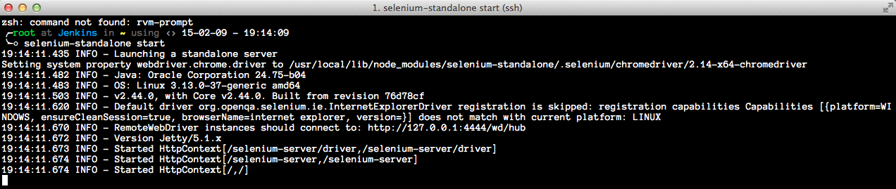
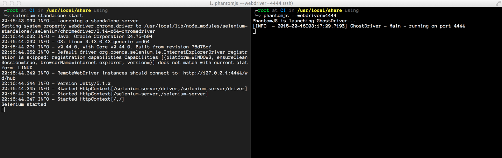

#### 1) Create droplet 

#### 2) SSH into ip.droplet

#### 3) copy-paste password from `email`

#### 4) copy-paste password from `email` again

#### 5) create new `unix` password

#### 6) repeat your new `unix` password 

#### 7) install `zsh` 

    apt-get update && apt-get install zsh && apt-get install git-core &&  wget https://github.com/robbyrussell/oh-my-zsh/raw/master/tools/install.sh -O - | zsh && chsh -s `which zsh` && sudo shutdown -r 0 

#### 8) install `nano`

    apt-get install nano

#### 9) config `~/.zshrc`

    # change these lines
    # theme name you prefer 
    ZSH_THEME="fino"

    # plugins you prefer 
    plugins=(git z last-working-dir history-substring-search history extract zsh-syntax-highlighting)

#### 10) install `git`

    apt-get install git 

#### 11) config `git`

    nano ~/.gitconfig 
    # add in file
    name = Your Name
    email = your@mail.com
    editor = nano

#### 12) Create new `linux` user

    adduser jenkins

#### 13) Add user to `sudoers` group

    usermod -a -G sudo jenkins

#### 14) Create password for new user 

#### 15) Install `Apache`

    apt-get install apache2

#### 16) Update the system 

    apt-get update && apt-get upgrade

#### 17) Install `java` development kit 

    apt-get install openjdk-7-jdk

#### 18) Add `jenkins` key and source list to apt

    wget -q -O - https://jenkins-ci.org/debian/jenkins-ci.org.key | sudo apt-key add -

#### 19) Create a sources list for `jenkins`

    sh -c 'echo deb http://pkg.jenkins-ci.org/debian binary/ > /etc/apt/sources.list.d/jenkins.list'

#### 20) Update cache before installing `jenkins`

    apt-get update

#### 21) Install `jenkins`

    apt-get install jenkins

#### 22) Go to `~/.zshrc`

    cd ~/.zshrc

#### 23) Generate new `ssh` keys

    ssh-keygen -t rsa -C "your@mail.com"

#### 24) Add your `ssh` public key to your [springloops.io](sringloops.com) account

    cat id_rsa.pub

#### 25) Add springloops to `~/.ssh/known_hosts`. 
    There is probably a better way to do it ...

    git clone ssh://sls@slsapp.com:1234/name/project.git

#### 26) Browse to droplet.ip:8080

#### 27) Install `jenkins` plugins

Go to __Manage Jenkins__ => __Manage Plugin__ => __Avaliable__

Check `git-client-plugin`, `git-plugin` and __install without restart__

#### 28) Update `jenkins` plugins 

Go to __Manage Jenkins__ => __Manage Plugin__ => __Updates__

Check all avaliable plugins and __download and install after restart__

#### 29) Restart `jenkins`

    sudo service jenkins restart 

#### 30) Setup credentials

Go to __Manage Jenkins__ => __Configure Global Security__

Check __Enable security__

Check __Jenkins’ own user database__

Check __Allow users to sign up__

Check __Logged-in users can do anything__

__SAVE__

#### 31) Sign up for `jenkins` account

#### 32) Disable user's sign up

Go to __Manage Jenkins__ => __Configure Global Security__

Uncheck __Allow users to sign up__

__SAVE__

#### 33) Create new job

Add __item name__ and check __Freestyle project__

#### 34) Configure job

Check `git`

Add repository URL in the same format as you will clone the repo

For Credentials add __Private__ `ssh key` which was previously generated for springloops.io

__SAVE__

Test it __Build Now__

#### 35) Add remote triggered builds 

Go to our job

__Configure__

Check __Trigger builds remotely (e.g., from scripts)__

Add __Authentication Token__

`http://doplet.ip:8080/job/job-name/build?token=TOKEN`

#### 36) Add `pre-push` hook to git `~/production/.git/hooks`

    nano  ~/produciton/.git/hooks
    # Add these lines
    echo "pre-push started"
    echo "http://droplet.ip:8080"
    curl -X POST http://droplet.ip:8080/job/production/build?token=TOKEN_NAME
    echo "pre-push finished"

#### 37) Install `webdriver.io`

    npm install webdriverio -g

#### 38) Install [`selenium-standalone`](https://github.com/vvo/selenium-standalone) globally

    npm install selenium-standalone@latest -g
    selenium-standalone install

#### 39) Install [`phantomjs`](http://phantomjs.org/)

Install the latest system software.

    sudo apt-get install build-essential chrpath libssl-dev libxft-dev

Install these packages needed by `PhantomJS` to work correctly.

    sudo apt-get install libfreetype6 libfreetype6-dev
    sudo apt-get install libfontconfig1 libfontconfig1-dev

Get it from the PhantomJS website.

    cd ~
    export PHANTOM_JS="phantomjs-1.9.7-linux-x86_64"
    wget https://bitbucket.org/ariya/phantomjs/downloads/$PHANTOM_JS.tar.bz2

Once downloaded, move compress file to`/usr/local/share/`, and create symlinks:

    sudo mv $PHANTOM_JS.tar.bz2 /usr/local/share/
    cd /usr/local/share/
    sudo tar xvjf $PHANTOM_JS.tar.bz2
    sudo ln -sf /usr/local/share/$PHANTOM_JS/bin/phantomjs /usr/local/share/phantomjs
    sudo ln -sf /usr/local/share/$PHANTOM_JS/bin/phantomjs /usr/local/bin/phantomjs
    sudo ln -sf /usr/local/share/$PHANTOM_JS/bin/phantomjs /usr/bin/phantomjs

Now, It (should) have `PhantomJS` properly on your system.

    phantomjs --version
    // 1.9.7

    selenium-standalone start
    # WebdriverIO listens on port 4444
    phantomjs --webdriver=4444

#### 40) Install [`webdriverCSS`](https://github.com/webdriverio/webdrivercss)

    sudo apt-get install graphicsmagick
    sudo apt-get install libcairo2-dev
    // install WebdriverCSS via NPM as usual
    npm install webdrivercss

#### 41) Install [`Mocha`](http://mochajs.org/)

    npm install mocha -g 

#### 42) Install ['Gulp'](http://gulpjs.com)

    npm install gulp -g

#### 43) Install ['Browserify'](http://browserify.org/)

    npm install browserify -g

#### 44) Install SauceLabs

Add `sauceLabs` credentials to `client`'s host configuration

    var client = webdriverio.remote({
            desiredCapabilities: {
                browserName: 'internet explorer',
                version: '8',
                platform: 'XP',
                tags: ['IE'],
                name: 'Basic test',
            },
            host: 'ondemand.saucelabs.com',
               port: 80,
               user: sauceLabs.user,
               key: sauceLabs.key,
               logLevel: 'silent'
    });

#### 45) Create staging server 

* Install `zsh`
* Install `git` 
* Add staging branch to production repo
* Set up `springloops` for autodeployment  
* Create `staging` branch out of `master` and push it to `origin`

#### 46) Fix permissions for `webdiverCSS`

In test folder 
    
    // Add permissions to folders were webdrivercss writes     
    chmod 777 src/screenshots
    chmod 777 build/screenshot-diffs
    chmod 777 node_modules/webdrivercss
    chmod 777 node_modules/webdrivercss/lib

#### 47) Configure production server deployments

Create __staging server__, which checks out `staging` branch and deploys it to __staging server__ . Create __production server__, which checks out `master` and deploys it to __production server__ 

#### 48) Config Jenkins `git plugin`

Configure system => Git plugin

And add `user.name` and `user.email` values

#### 49) 

#### Misc 

`Jenkins` home directory - `$JENKINS_HOME` - `/var/lib/jenkins`

`Jenkins` `git` location - `${JENKINS_HOME}/jobs/<JOB_NAME>/workspace`

Restart `jenkins` - `sudo service jenkins restart`

#### Notes 

[Webdriver.io multiRemote is not yet implemented](https://github.com/webdriverio/webdriverio/issues/424)

#### Glossary 

__Code coverage__ - is a measure used to describe the degree to which the source code of a program is tested by a particular test suite. A program with high code coverage has been more thoroughly tested and has a lower chance of containing software bugs than a program with low code coverage.

__e2e testing__ - or __end-to-end__ or __UI testing__ is a methodology used to test whether the flow of an application is performing as designed from start to finish. In simple words, it is testing of your application from the user endpoint where the whole system is a blackbox with only the UI exposed to the user.

__Unit testing__ - is a practice of testing certain functions and areas – or units – of our code. This gives us the ability to verify that functions work as expected. For a function and given a set of inputs, we can determine if the function is returning the proper values and will gracefully handle failures during the course of execution should invalid input be provided.

Ultimately, this helps us to identify failures in our algorithms and/or logic to help improve the quality of the code that composes a certain function.

 