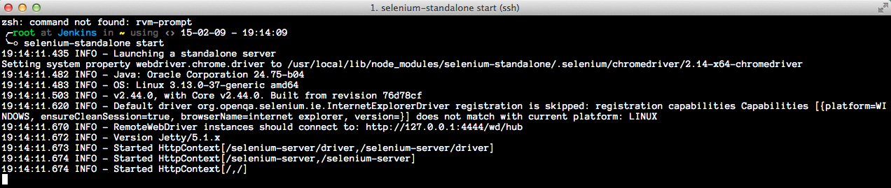

# Continuous integration 

This project is an example of Continuous Integration. 
It is [Jenkins CI](http://jenkins-ci.org/) running [Mocha](http://mochajs.org/) tests with cross-browser [SauceLabs](saucelabs.com) integrations on [Selenium RC](http://www.seleniumhq.org/projects/remote-control/) via [Webdriver.io](http://webdriver.io/) javascript bindings and [WebdriverCSS](https://github.com/webdriverio/webdrivercss) visual regression tests via [Applitools](applitools.com).

[CI diagram flow](http://goo.gl/qQlYYy)

# Workflow Overview

1. Developer pushes changed code base to `production` branch
2. Git commit triggers `jenkins` build script
3. When build script is successfully executed, `jenkins` runs Mocha tests.  
4. When all tests pass, than `jenkins` triggers production deployment.

# Project configuration

## Creating Web Server 

In this example I'll be using Digital Ocean SSD cloud hosting, but you can use whatever hosting you like. Let's setup __2 GB/2 CPUs__ [droplet](http://monosnap.com/image/oLidA02XDTRd5atmWg8pcXi8NjhdzD) with [node.js on Ubuntu 14.04 image](http://monosnap.com/image/ceBTWoVJd6P7nBmUkN23G2O40F9PT5). 

## Setting up `ssh` access 

Once the Droplet was succefully created we need to [reset root password](http://monosnap.com/image/ObqUKlSOoOBiWcNxuS5YNvegYtgNpc). Copy the password from the recovery email and pool up `iTerm` or `Terminal`.
To add a SSH key after the creation of the droplet, you need to add the contents of the public key to the file `~/.ssh/authorized_keys`. You can do that by running this on your local computer: 

    cat ~/.ssh/id_rsa.pub | ssh root@your.ip.address "cat >> ~/.ssh/authorized_keys"

After a few seconds you will be prompted for a password, type it in and BOOM, the next time ssh, you won't be prompted for a password! 

__Note:__ 

When a domain has been moved from one server to another an issue with SSH logins may occur. The warning dialog that most SSH programs give looks something like this:

    @@@@@@@@@@@@@@@@@@@@@@@@@@@@@@@@@@@@@@@@@@@@@@@@@@@@@@@@@@@
    @    WARNING: REMOTE HOST IDENTIFICATION HAS CHANGED!     @
    @@@@@@@@@@@@@@@@@@@@@@@@@@@@@@@@@@@@@@@@@@@@@@@@@@@@@@@@@@@
    IT IS POSSIBLE THAT SOMEONE IS DOING SOMETHING NASTY!
    Someone could be eavesdropping on you right now (man-in-the-middle attack)!
    It is also possible that the RSA host key has just been changed.
    The fingerprint for the RSA key sent by the remote host is
    06:ea:f1:f8:db:75:5c:0c:af:15:d7:99:2d:ef:08:2a.
    Please contact your system administrator.
    Add correct host key in /home/user/.ssh/known_hosts to get rid of this message.
    Offending key in /home/user/.ssh/known_hosts:4
    RSA host key for domain.com has changed and you have requested strict checking.
    Host key verification failed.

The SSH program will print this message and often exit, prohibiting the user from connecting to the suspicious site. This problem arises when a site has changed servers, and the new server RSA key which is transmitted when authenticating is different from the old server.

## Installing and configuring `oh-my-zsh`

### Installing `zsh`

    // Update package manager 
    apt-get update 
    // Install pre requirements
    apt-get install zsh && apt-get install git-core
    // Install zsh
    wget https://github.com/robbyrussell/oh-my-zsh/raw/master/tools/install.sh -O - | zsh
    // Change shell to zsh
    chsh -s `which zsh`
    // Restart droplet 
    sudo shutdown -r 0

Or a nice one-liner:

    apt-get update && apt-get install zsh && apt-get install git-core &&  wget https://github.com/robbyrussell/oh-my-zsh/raw/master/tools/install.sh -O - | zsh && chsh -s `which zsh` && sudo shutdown -r 0

Source: [Installing `oh-my-zsh` on Ubuntu](https://gist.github.com/tsabat/1498393)

### Configuring `oh-my-zsh`

`oh-my-zsh` has a great variety of awesome themes, you can choose the one you like here - [http://zshthem.es/all/](http://zshthem.es/all/). I prefer `fino-time`, because it has useful output with a server name you are in, so you won't get lost in your ssh tonnels. 

Install `nano` text editor or any other, because we are going to edit `~.zshrc`

    apt-get install nano 

Open `.zshrc` file:

    nano ~/.zshrc

And change `ZSH_THEME` on the one you like: 

    ZSH_THEME="fino-time"

and let's also add some usefull plugins we might need later: 

    plugins=(git z last-working-dir history-substring-search history extract zsh-syntax-highlighting)

Than hit <kbd>Ctrl</kbd>+<kbd>O</kbd> and <kbd>Enter</kbd>. 

Restart your droplet for `zsh` to apply the changes: 

    sudo shutdown -r 0

## Installing and configuring `git`

Install git 

    apt-get install git 

Setup `git` global configuration. 

Create `~/.gitconfig` file and copy this into it:

    [user]
        name = Your Name
        email = your-mail@mail.com
    [core]
    excludesfile = .gitignore_global
    editor = nano
    [color]
        diff = auto
        status = auto
        branch = auto
        interactive = auto
        ui = auto
    [color "branch"]
        current = green bold
        local = green
        remote = red bold
    [color "sh"]
        branch = yellow
    [color "diff"]
        meta = blue bold
        frag = magenta bold
        old = red
        new = green
    [color "status"]
        added = green
        changed = blue bold
        untracked = red
    [alias]
        st = status -sb
        sb = status -sb
        aa = add -A
        br = branch
        ci = commit
        co = checkout
        df = diff
        ui = update-index
        unchange = update-index --assume-unchanged
        change = update-index --no-assume-unchanged
        dc = diff --cached
        last = log -1 HEAD
        lg = log --graph --decorate --pretty=format:'%C(magenta)%h%Creset -%C(red)%d%Creset %s %Cgreen(%cr) %C(bold blue)<%an>%Creset' --abbrev-commit --date=relative
        lg10 = log --graph --decorate --pretty=format:'%C(magenta)%h%Creset -%C(red)%d%Creset %s %Cgreen(%cr) %C(bold blue)<%an>%Creset' --abbrev-commit --date=relative -10
        lg20 = log --graph --decorate --pretty=format:'%C(magenta)%h%Creset -%C(red)%d%Creset %s %Cgreen(%cr) %C(bold blue)<%an>%Creset' --abbrev-commit --date=relative -20
        lgf = log --graph --decorate --pretty=format:'%C(magenta)%h%Creset -%C(red)%d%Creset %s %Cgreen(%cr) %C(bold blue)<%an>%Creset' --abbrev-commit --date=relative -40
        lr = log --decorate --pretty=format:'%C(magenta)%h%Creset -%C(red)%d%Creset %s %Cgreen(%cr) %C(bold blue)<%an>%Creset' --abbrev-commit --date=relative --reverse
        lr10 = log --decorate --pretty=format:'%C(magenta)%h%Creset -%C(red)%d%Creset %s %Cgreen(%cr) %C(bold blue)<%an>%Creset' --abbrev-commit --date=relative -10 --reverse
        lr20 = log --decorate --pretty=format:'%C(magenta)%h%Creset -%C(red)%d%Creset %s %Cgreen(%cr) %C(bold blue)<%an>%Creset' --abbrev-commit --date=relative -10 --reverse
        tree = log --graph --decorate --pretty=format:'%C(magenta)%h%Creset -%C(red)%d%Creset %s %Cgreen(%cr) %C(bold blue)<%an>%Creset' --abbrev-commit --date=relative
        lgq = !git --no-pager log --pretty=format:'%C(magenta)%h%Creset -%C(red)%d%Creset %s %Cgreen(%cr) %C(bold blue)<%an>%Creset' --abbrev-commit --date=relative -20
        today = diff --stat @{12am}..HEAD
        total = !git log --pretty=oneline | wc -l
        oh = !git push origin && git push heroku
        tl = tag -l -n100
        rehead = reset HEAD
        reci = reset --soft HEAD^
        back = !git reci && git rehead
        rehoh = reset --hard ORIG_HEAD
        # http://blog.blindgaenger.net/advanced_git_aliases.html
        ignore = !([ ! -e .gitignore ] && touch .gitignore) | echo $1 >>.gitignore
        r  = !git ls-files -z --deleted | xargs -0 git rm
        x  = commit -m
        xa = commit -a -m
        a  = add
    [github]
        user = YourUsename
    [filter "media"]
        required = true
        clean = git media clean %f
        smudge = git media smudge %f
    [fetch]
        prune = true

Create `~/.gitignore_global` file and copy this into it:

    # Compiled source 
    ####################
    *.com
    *.class
    *.dll
    *.exe
    *.o
    *.so
    # Packages #
    ############
    # it's better to unpack these files and commit the raw source
    # git has its own built in compression methods
    *.7z
    *.dmg
    *.gz
    *.iso
    *.jar
    *.rar
    *.tar
    *.zip
    # Logs and databases #
    ######################
    *.log
    *.sql
    *.sqlite
    # OS generated files #
    ######################
    .DS_Store
    .DS_Store?
    ._*
    .Spotlight-V100
    .Trashes
    ehthumbs.db
    Thumbs.db
    # Random VM Files/Folders
    bad-proxies.txt

# Configure Jenkins Server 

Create new linux user, by typing:

    adduser jenkins

You'll need to provide a password (a different strong password, stored securely), and then it'll ask a series of optional questions.

We want to switch to our `jenkins` user, but before we logout, we need to grant our new user `sudo` privileges so it'll have the ability to perform administrative actions:

    usermod -a -G sudo jenkins

# Installing Jenkins 

You need to have a `JDK` and `JRE` installed before installing `Jenkins`. 

This will install the Java Runtime Environment (JRE):

    sudo apt-get install default-jre

Install Java Development Kit (JDK), which is needed to compile `Java` applications: 

    sudo apt-get install default-jdk

Install `Jenkins`:

    wget -q -O - https://jenkins-ci.org/debian/jenkins-ci.org.key | sudo apt-key add -
    sudo sh -c 'echo deb http://pkg.jenkins-ci.org/debian binary/ > /etc/apt/sources.list.d/jenkins.list'
    sudo apt-get update
    sudo apt-get install jenkins

Reboot Jenkins Server and you are able to open `digital.ocean.ip:8080`

[Alternative](https://www.rosehosting.com/blog/install-jenkins-on-an-ubuntu-14-04-vps/)

# Configuring `ssh` keys for Jenkins Server 

[generating ssh keys](https://help.github.com/articles/generating-ssh-keys/)

Create a seperate `git` account and `ssh` into `jenkins` server 

Generate new `ssh` key

    ssh-keygen -t rsa -C "your_email@example.com"

Next, you'll be asked to enter a passphrase. Then add your new key to the ssh-agent:

    # start the ssh-agent in the background
    eval "$(ssh-agent -s)"
    # Agent pid 59566
    ssh-add ~/.ssh/id_rsa

Copy your public key `id_rsa.pub` to your new `git` account. 

Git clone the repo, which will be in continiuos integration and authentificate host. 

# Configuring Jenkins

* [Git Client Plugin](https://wiki.jenkins-ci.org/display/JENKINS/Git+Client+Plugin)
* [Git Plugin](https://wiki.jenkins-ci.org/display/JENKINS/Git+Plugin)
* [Secure Jenkins](http://www.vogella.com/tutorials/Jenkins/article.html#jenkinsconfiguration_user), [screenshot](http://monosnap.com/image/N4Zrcvvuv54v00QCd3nUiMz47RYBUT)

# Install test dependencies 

### Install `webdriver.io`

    npm install webdriverio -g

### Install [`selenium-standalone`](https://github.com/vvo/selenium-standalone) globally

    npm install selenium-standalone@latest -g
    selenium-standalone install

Test if `selenium-standalone` is working by typing: 

    selenium-standalone start 

[selenium-standalone start screenshot](http://monosnap.com/image/KOyKbavpsb4VLJr8n6ETBxWVOkZQkj)

### Install [`phantomjs`](http://phantomjs.org/)

[How to install PhantomJS on Ubuntu](https://gist.github.com/julionc/7476620)

First, install the latest system software.

    sudo apt-get install build-essential chrpath libssl-dev libxft-dev

Install these packages needed by `PhantomJS` to work correctly.

    sudo apt-get install libfreetype6 libfreetype6-dev
    sudo apt-get install libfontconfig1 libfontconfig1-dev

Get it from the PhantomJS website.

    cd ~
    export PHANTOM_JS="phantomjs-1.9.7-linux-x86_64"
    wget https://bitbucket.org/ariya/phantomjs/downloads/$PHANTOM_JS.tar.bz2

Once downloaded, move compress file to` /usr/local/share/`, and create symlinks:

    sudo mv $PHANTOM_JS.tar.bz2 /usr/local/share/
    cd /usr/local/share/
    sudo tar xvjf $PHANTOM_JS.tar.bz2
    sudo ln -sf /usr/local/share/$PHANTOM_JS/bin/phantomjs /usr/local/share/phantomjs
    sudo ln -sf /usr/local/share/$PHANTOM_JS/bin/phantomjs /usr/local/bin/phantomjs
    sudo ln -sf /usr/local/share/$PHANTOM_JS/bin/phantomjs /usr/bin/phantomjs

Now, It (should) have `PhantomJS` properly on your system.

    phantomjs --version
    // 1.9.7

__Note__: WebdriverIO listens on port 4444, so you should start `phantomjs` like:

    phantomjs --webdriver=4444

### Install [`webdriverCSS`](https://github.com/webdriverio/webdrivercss)

WebdriverCSS uses GraphicsMagick for image processing as well as node-canvas for comparing and analyzing screenshots with node-resemble. To install this package you'll need to have GraphicsMagick, Cairo and of course Node.JS, NPM and Python preinstalled on your system.

    sudo apt-get install graphicsmagick
    sudo apt-get install libcairo2-dev
    // install WebdriverCSS via NPM as usual
    npm install webdrivercss

### Install [`Mocha`](http://mochajs.org/)

    npm install mocha -g 

### Install ['Gulp'](http://gulpjs.com)

    npm install gulp -g

### Install ['Browserify'](http://browserify.org/)

    npm install browserify -g

### Install firefox browser 

    apt-get install firefox 

# Setup Web Server 

* Create Digital Ocean Droplet 
* Install `oh-my-zsh` and plugins
* Setup `ssh`
* Install `git`
* Copy `.gitconfig` and `.gitignore_global`

Create a new user: 

    adduser jenkins-web-server
    usermod -a -G sudo jenkins-web-server

It will prompt you for a new `Unix` password

# Create Springloops project for Web Server 

[Screenshot](http://monosnap.com/image/4rowF5vGqLuHmSccc3KeoB7P7o5Uo2)

// @content
//
//

# Misc

Copy file from Jenkins server to your local machine:

    scp root@droplet.ip.address:/path/to/file path/on/local-machine

Restart `jenkins` from cli: 

    sudo /etc/init.d/jenkins restart

Unistalling `Jenkins`: 

[Unistall `jenkins`](http://installion.co.uk/ubuntu/saucy/universe/j/jenkins/uninstall/index.html)

sudo apt-get remove jenkins
sudo apt-get remove --auto-remove jenkins
sudo apt-get purge jenkins
sudo apt-get purge --auto-remove jenkins

[How to run jenkins as a different user](http://stackoverflow.com/questions/6692330/how-to-run-jenkins-as-a-different-user)

Springloops.io `ssh` configs

1. Go to people 
2. Find User 
3. Profile details
4. change ssh key

# Glossary 

* [Selenium RC(Remote Control)](http://www.seleniumhq.org/projects/remote-control/) - is an API accessible from multiple languages. Rather than recording tests, you write programs that call into the API to control the browser
* [WebdriverIO](http://webdriver.io/) - Selenium 2.0 bindings for NodeJS
* [WebdriverCSS](https://github.com/webdriverio/webdrivercss) - is a plugin for an automatic visual regression for WebdriverIO. After initialization it enhances a WebdriverIO instance with an additional command called webdrivercss and enables the possibility to save screenshots of specific parts of your application
* [SauceLabs Integration](https://github.com/webdriverio/webdriverio/blob/master/examples/webdriverio.browserstack.js) - Automated Cross-Browser testing with wide collection of plattforms, devices and browser combinations.
* [Applitools Eyes](https://applitools.com/) - is a comprehensive automated UI validation solution with really smart image matching algorithms that are unique in this area. As a cloud service it makes your regression tests available everywhere and accessible to everyone in your team, and its automated maintenance features simplify baseline maintenance.
* [Jenkins CI](jenkins-ci.org) - is an open source continuous integration tool written in Java. It provides continuous integration services for software development. It is a server-based system running in a servlet container.
* [Mocha](http://mochajs.org/) - Mocha is a feature-rich JavaScript test framework running on node.js and the browser, making asynchronous testing simple and fun

# Articles

[Jenkins and Node](https://blog.dylants.com/2013/06/21/jenkins-and-node/)

[Trigger Jenkins on git push](http://stackoverflow.com/questions/5784329/how-can-i-make-jenkins-ci-with-git-trigger-on-pushes-to-master)

[Setting up continious integration deployment with jenkins](http://code.tutsplus.com/tutorials/setting-up-continuous-integration-continuous-deployment-with-jenkins--cms-21511)

[Video Tutorial on Jenkins](https://www.youtube.com/watch?v=4sANX9AhM8c)

[How to install and use Jenkins](https://www.digitalocean.com/community/tutorials/how-to-install-and-use-jenkins-on-ubuntu-12-04)

# Resources

[Webdriver.io google group](https://groups.google.com/forum/#!forum/webdriverio)

[How to configure git commit hook](http://stackoverflow.com/questions/12794568/how-to-configure-git-post-commit-hook)
